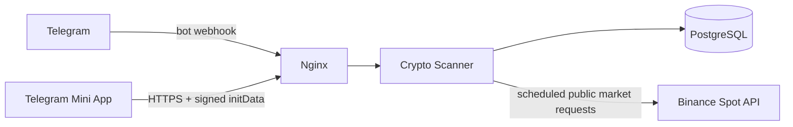
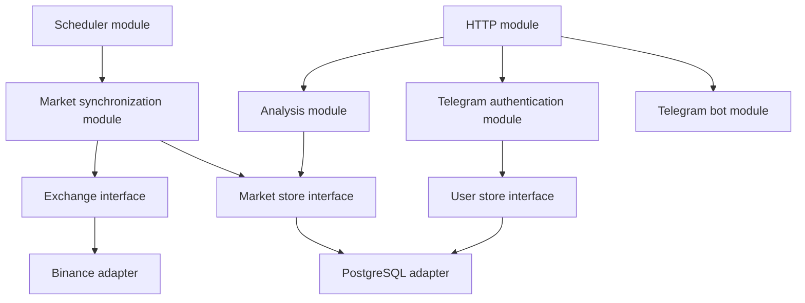
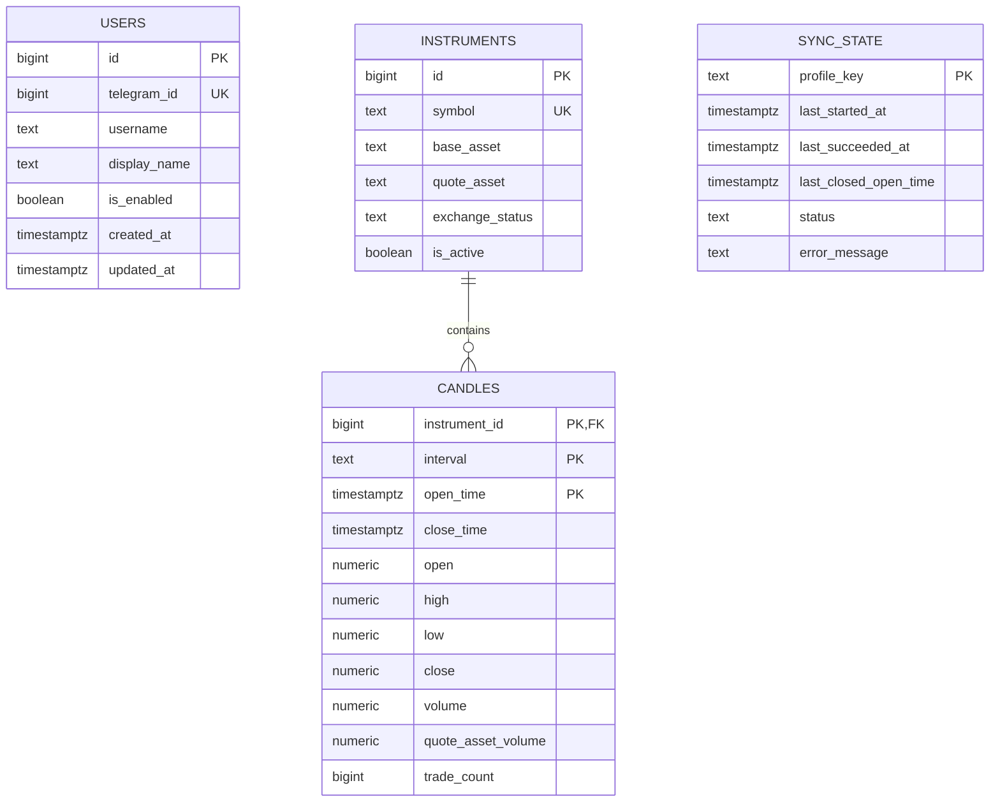
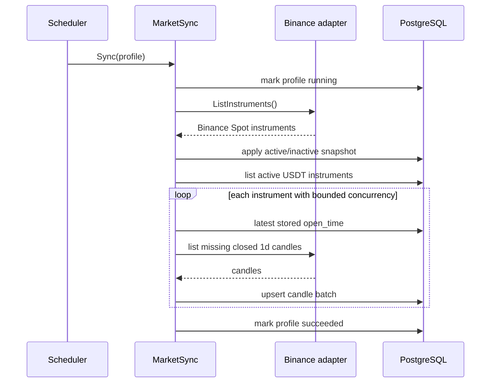

# Crypto Scanner — MVP Engineering Specification

**Status:** implementation-ready  
**Language:** Go  
**Document version:** 1.0  
**Date:** 2026-08-04

## 1. Purpose

Crypto Scanner is a private HTTP service for screening cryptocurrency markets. The MVP keeps a local, continuously updated copy of closed Binance Spot daily candles and calculates candle-range percentiles on demand.

The service supports two user operations:

1. Calculate a requested range percentile for one symbol.
2. Find all symbols whose requested range percentile is at least a user-supplied percentage.

Binance access is centralized in background synchronization. User requests never call Binance and never mutate market data.

## 2. Product scope

### 2.1 MVP behavior

- Run as one modular-monolith Go process behind Nginx.
- Expose versioned JSON HTTP endpoints.
- Authenticate Telegram Mini App users using signed `initData`.
- Allow only explicitly enabled Telegram users.
- Receive Telegram Bot API updates by webhook.
- Source market data from Binance Spot.
- Track active `USDT` quote pairs only.
- Store closed `1d` candles using Binance's default UTC candle boundaries.
- Backfill up to 30 latest closed candles when an instrument is first discovered.
- Append missing candles after restart or on each scheduled synchronization.
- Preserve historical candles; do not use a rolling 30-row window.
- Calculate percentiles synchronously from PostgreSQL on every analysis request.
- Never cache or persist calculated analysis results.
- Keep different exchanges physically isolated in separate PostgreSQL schemas.
- Make another exchange addable as a new adapter and schema without changing analyzers.

### 2.2 Explicit exclusions

The MVP does not place orders, access Binance accounts, process balances, use futures, ingest live/incomplete candles, expose user-triggered synchronization, use WebSockets/SSE, cache analysis results, or run multiple application instances against the same scheduler.

## 3. Fixed decisions and authoring resolutions

The following decisions came directly from the requirements discussion:

- Go modular monolith with ports/adapters, without ceremonial Clean Architecture layers.
- Standard `net/http`; no external HTTP router.
- PostgreSQL, `pgx/v5`, `sqlc`, and handwritten SQL migrations.
- Migrations run as a separate command before the server starts.
- Standard `log/slog`.
- Official Binance Go connector, hidden inside the Binance adapter.
- `github.com/go-telegram/bot` and Telegram webhook delivery.
- `NUMERIC` in PostgreSQL for exchange values; `float64` inside statistical calculations.
- Only closed candles.
- No analysis-result cache.
- Daily UTC candles independent of the user's timezone.
- Physical data isolation per exchange.
- Two percentile use cases: one symbol and market-wide filtering.

The discussion left four implementation details undecided. This specification resolves them as follows so implementation is deterministic:

- A requested period requires that many candles. The service never silently calculates over fewer rows.
- Missing history is not downloaded from a user request. The affected symbol returns `insufficient_data`.
- Market-search results are sorted by `range_percent` descending, then `symbol` ascending.
- Market search returns the complete matching Binance Spot/USDT set; pagination is unnecessary for the expected market size.

## 4. Architecture

### 4.1 System context



### 4.2 Runtime modules



### 4.3 Module rules

- HTTP handlers decode, validate, call an application module, and encode a response. They contain no SQL or percentile logic.
- The analysis module owns period selection, percentile calculation, per-symbol status, sorting, and result assembly.
- The synchronization module owns discovery, backfill, incremental loading, retries, and durable sync-state updates.
- The scheduler only determines when synchronization runs. It does not know Binance or SQL details.
- The Binance adapter is the only module importing Binance connector types.
- PostgreSQL generated types do not leave the PostgreSQL adapter.
- Domain values do not contain JSON, SQL, Telegram, or Binance-specific annotations.
- Interfaces are defined at the seam of the calling module, not in a global `interfaces` package.
- Do not create generic `utils`, `helpers`, `common`, `models`, `services`, or `repositories` dumping-ground packages.

### 4.4 Required interfaces

Interfaces below define behavior; exact filenames may differ, but their surface must stay comparably small.

```go
type Exchange interface {
	ListInstruments(ctx context.Context) ([]Instrument, error)
	ListClosedCandles(ctx context.Context, req CandleRequest) ([]Candle, error)
}

type MarketStore interface {
	ApplyInstrumentSnapshot(ctx context.Context, items []Instrument) error
	ListActiveInstruments(ctx context.Context) ([]Instrument, error)
	UpsertCandles(ctx context.Context, items []Candle) error
	ListLatestCandles(ctx context.Context, instrumentID int64, limit int) ([]Candle, error)
	GetSyncState(ctx context.Context, profile SyncProfile) (SyncState, error)
	SaveSyncState(ctx context.Context, state SyncState) error
}

type UserStore interface {
	FindEnabledByTelegramID(ctx context.Context, telegramID int64) (User, error)
}

type Analyzer interface {
	Name() string
	Analyze(ctx context.Context, input AnalysisInput) (AnalysisResult, error)
}
```

`PercentileAnalyzer` is the only analyzer in the MVP. New analyzers are ordinary Go packages registered during composition; dynamic `.so` plugins are not used.

## 5. Domain model

```go
type Instrument struct {
	ID          int64
	Symbol      string
	BaseAsset   string
	QuoteAsset  string
	Status      string
	Active      bool
}

type Candle struct {
	InstrumentID    int64
	Interval        string
	OpenTime        time.Time
	CloseTime       time.Time
	Open            float64
	High            float64
	Low             float64
	Close           float64
	Volume          float64
	QuoteAssetVolume float64
	TradeCount      int64
}

type SyncProfile struct {
	Exchange   string
	Market     string
	QuoteAsset string
	Interval   string
	TimeZone   string
}
```

MVP profile:

```text
exchange    = binance
market      = spot
quote_asset = USDT
interval    = 1d
time_zone   = UTC
```

The domain uses normalized uppercase Binance symbols such as `BTCUSDT`. Symbols are exact identifiers; display formatting belongs to the frontend.

## 6. PostgreSQL model

### 6.1 Schema ownership

- `app`: users and application-owned data.
- `binance_spot`: Binance Spot instruments, candles, and synchronization state.
- A future exchange gets its own schema, for example `bybit_spot`; its rows must not be added to `binance_spot` tables.

### 6.2 Entity diagram



### 6.3 Authoritative DDL

```sql
CREATE SCHEMA IF NOT EXISTS app;
CREATE SCHEMA IF NOT EXISTS binance_spot;

CREATE TABLE app.users (
    id           BIGINT GENERATED ALWAYS AS IDENTITY PRIMARY KEY,
    telegram_id  BIGINT NOT NULL UNIQUE,
    username     TEXT,
    display_name TEXT,
    is_enabled   BOOLEAN NOT NULL DEFAULT TRUE,
    created_at   TIMESTAMPTZ NOT NULL DEFAULT now(),
    updated_at   TIMESTAMPTZ NOT NULL DEFAULT now()
);

CREATE TABLE binance_spot.instruments (
    id              BIGINT GENERATED ALWAYS AS IDENTITY PRIMARY KEY,
    symbol          TEXT NOT NULL UNIQUE,
    base_asset      TEXT NOT NULL,
    quote_asset     TEXT NOT NULL,
    exchange_status TEXT NOT NULL,
    is_active       BOOLEAN NOT NULL,
    CONSTRAINT instruments_symbol_nonempty CHECK (symbol <> ''),
    CONSTRAINT instruments_base_nonempty CHECK (base_asset <> ''),
    CONSTRAINT instruments_quote_nonempty CHECK (quote_asset <> '')
);

CREATE TABLE binance_spot.candles (
    instrument_id     BIGINT NOT NULL
        REFERENCES binance_spot.instruments(id),
    interval          TEXT NOT NULL,
    open_time         TIMESTAMPTZ NOT NULL,
    close_time        TIMESTAMPTZ NOT NULL,
    open              NUMERIC NOT NULL,
    high              NUMERIC NOT NULL,
    low               NUMERIC NOT NULL,
    close             NUMERIC NOT NULL,
    volume            NUMERIC NOT NULL,
    quote_asset_volume NUMERIC NOT NULL,
    trade_count       BIGINT NOT NULL,
    PRIMARY KEY (instrument_id, interval, open_time),
    CONSTRAINT candles_supported_interval CHECK (interval = '1d'),
    CONSTRAINT candles_time_order CHECK (close_time > open_time),
    CONSTRAINT candles_open_positive CHECK (open > 0),
    CONSTRAINT candles_high_valid CHECK (high >= open AND high >= close AND high >= low),
    CONSTRAINT candles_low_valid CHECK (low <= open AND low <= close),
    CONSTRAINT candles_volume_nonnegative CHECK (volume >= 0),
    CONSTRAINT candles_quote_volume_nonnegative CHECK (quote_asset_volume >= 0),
    CONSTRAINT candles_trade_count_nonnegative CHECK (trade_count >= 0)
);

CREATE INDEX candles_instrument_interval_time_desc_idx
    ON binance_spot.candles (instrument_id, interval, open_time DESC);

CREATE TABLE binance_spot.sync_state (
    profile_key            TEXT PRIMARY KEY,
    last_started_at        TIMESTAMPTZ,
    last_succeeded_at      TIMESTAMPTZ,
    last_closed_open_time  TIMESTAMPTZ,
    status                 TEXT NOT NULL,
    error_message          TEXT,
    CONSTRAINT sync_state_status
        CHECK (status IN ('never_run', 'running', 'succeeded', 'failed'))
);
```

### 6.4 Persistence invariants

- Candle uniqueness is `(instrument_id, interval, open_time)`.
- Upserting the same Binance candle is idempotent.
- No candle with `close_time >= synchronization_started_at` may be stored.
- `NUMERIC` values are scanned through explicit adapter conversion and checked before conversion to `float64`.
- An inactive instrument's candles remain stored, but it is excluded from analysis.
- Instrument identity never depends on a display name.
- A synchronization failure never deletes previously valid instruments or candles.
- `sync_state` is observability and restart metadata, not a distributed lock.

## 7. Market synchronization

### 7.1 Scheduling

The embedded scheduler computes the next UTC daily-candle boundary. It runs at `00:00:30 UTC`, not every 24 hours from process start.

Only one synchronization may run inside the process. A non-blocking process-local mutex prevents overlap. The MVP is deployed as a single instance; multi-instance leader election is not implemented.

At startup:

1. Start HTTP only after configuration and PostgreSQL checks pass.
2. Run one catch-up synchronization asynchronously.
3. Schedule the next boundary-aligned run.

### 7.2 Synchronization sequence



### 7.3 Instrument discovery

- Request Binance `exchangeInfo` through the connector.
- Consider only Spot instruments with `quoteAsset == "USDT"`.
- `exchange_status == "TRADING"` maps to `is_active = true`.
- Any previously known instrument absent from the eligible snapshot, or no longer `TRADING`, becomes inactive.
- A reappearing `TRADING` instrument becomes active again and missing candles are backfilled.
- Discovery and deactivation occur transactionally so a partial list is never exposed.

### 7.4 Candle loading

For each active instrument:

- If no candles exist, request the latest 30 daily klines.
- If candles exist, start after the latest stored `open_time` and page until caught up.
- Exclude the current incomplete candle by validating `close_time < sync_started_at`.
- Accept fewer than 30 candles for newly listed symbols.
- Upsert batches; do not delete older candles.
- A failure for one instrument is recorded and does not prevent attempts for other instruments.
- The overall profile is `failed` if any instrument remains failed after retries; successfully stored rows remain valid and idempotent.

### 7.5 Rate limiting and retries

- Use connector-provided rate-limit metadata where available and a shared `golang.org/x/time/rate` limiter in the Binance adapter.
- Use a small bounded worker pool; default `4` workers.
- Retry only transport failures, HTTP `429`, and Binance/server `5xx` responses.
- Honor `Retry-After` when present; otherwise use exponential backoff with jitter.
- Default retry attempts: `5` per request.
- Do not retry malformed requests, invalid symbols after refreshed discovery, or other permanent `4xx` responses.
- All calls carry `context.Context`; shutdown cancels pending waits and requests.

## 8. Analysis

### 8.1 Candle range

For every selected closed candle:

```text
range_percent = ((high - low) / open) * 100
```

`open` must be positive. Invalid persisted data is treated as an internal-data error, not skipped silently.

### 8.2 Period selection

For `period_days = N`, select the latest `N` closed `1d` candles ordered by `open_time DESC`, then calculate over all `N` values.

- `N` must be within `1..3650`.
- If fewer than `N` candles exist, the symbol result is `insufficient_data`.
- Inactive or unknown symbols are not analyzed.
- User requests never trigger Binance access or synchronization.

### 8.3 Percentile definition

Use linear interpolation equivalent to Hyndman–Fan type 7, the common default in many statistical systems.

Given sorted values `x[0..n-1]` and percentile `p` in `[0, 100]`:

```text
rank  = (p / 100) * (n - 1)
lower = floor(rank)
upper = ceil(rank)
value = x[lower] + (rank - lower) * (x[upper] - x[lower])
```

For one value, every percentile equals that value. API output is rounded to four decimal places only during JSON encoding; comparisons use the unrounded value.

Example:

```text
ranges = [1, 2, 4, 8]
p = 75
rank = 2.25
value = 4 + 0.25 * (8 - 4) = 5
```

### 8.4 One-symbol analysis

Input: `symbol`, `period_days`, `percentile`.

Output: percentile range percentage plus the actual candle count and time coverage.

### 8.5 Market search

Input: `period_days`, `percentile`, `minimum_range_percent`.

For every active Binance Spot/USDT instrument:

1. Load its latest requested candles.
2. Mark it `insufficient_data` if the requested count is unavailable.
3. Calculate the requested percentile otherwise.
4. Include it when the unrounded value is `>= minimum_range_percent`.
5. Sort included items by value descending, then symbol ascending.

Insufficient symbols do not fail the market-wide request. Their count is returned in response metadata.

## 9. HTTP contract

### 9.1 General rules

- Base path: `/api/v1`.
- JSON uses `snake_case`.
- Timestamps use RFC 3339 UTC.
- Percentages are numbers, not strings and not fractions.
- Unknown JSON fields are rejected where request bodies exist.
- All business endpoints require Telegram Mini App authentication.
- `GET /health/live`, `GET /health/ready`, and the Telegram webhook are outside Mini App authentication.
- Request bodies are size-limited.
- Every response includes `X-Request-ID`; an incoming valid value may be reused.

### 9.2 Authentication header

```http
Authorization: tma <raw Telegram.WebApp.initData>
```

The middleware:

1. Parses the scheme exactly as `tma`.
2. Validates the Telegram signature using `TELEGRAM_BOT_TOKEN`.
3. Rejects missing or malformed user data.
4. Rejects `auth_date` older than `TELEGRAM_INIT_DATA_MAX_AGE`.
5. Looks up `telegram_id` in `app.users`.
6. Rejects missing or disabled users.
7. Adds the authenticated user to request context.

The frontend must never send a standalone Telegram ID as proof of identity.

### 9.3 Get one symbol percentile

```http
GET /api/v1/analysis/percentile/BTCUSDT?period_days=30&percentile=75
```

Successful response:

```json
{
  "symbol": "BTCUSDT",
  "period_days": 30,
  "percentile": 75,
  "range_percent": 4.1827,
  "candle_count": 30,
  "from": "2026-07-05T00:00:00Z",
  "to": "2026-08-03T00:00:00Z"
}
```

### 9.4 Find matching symbols

```http
GET /api/v1/analysis/percentile?period_days=30&percentile=75&minimum_range_percent=3
```

Successful response:

```json
{
  "period_days": 30,
  "percentile": 75,
  "minimum_range_percent": 3,
  "matched_count": 2,
  "analyzed_count": 412,
  "insufficient_data_count": 7,
  "items": [
    {
      "symbol": "SOMEUSDT",
      "range_percent": 9.4381,
      "candle_count": 30
    },
    {
      "symbol": "OTHERUSDT",
      "range_percent": 5.1022,
      "candle_count": 30
    }
  ]
}
```

### 9.5 Health endpoints

`GET /health/live` returns `200` when the process is running.

`GET /health/ready` checks:

- PostgreSQL is reachable.
- Required migrations are present.
- At least one successful market sync exists.

It returns `503` until all checks pass. A failed latest sync does not make readiness fail if a previous successful dataset remains available.

### 9.6 Telegram webhook

```http
POST /telegram/webhook
X-Telegram-Bot-Api-Secret-Token: <secret>
```

- Reject a missing or incorrect secret with `401` before decoding the body.
- Limit and decode one Telegram update.
- Return `200` after a recognized update is handled.
- `/start` sends a message containing the configured Mini App URL.
- Unknown updates are acknowledged without side effects.
- The webhook does not expose market-analysis operations.

### 9.7 Error envelope

```json
{
  "error": {
    "code": "insufficient_data",
    "message": "Not enough closed candles for the requested period",
    "details": {
      "symbol": "NEWUSDT",
      "required": 30,
      "available": 18
    }
  },
  "request_id": "01J..."
}
```

Canonical mappings:

| HTTP | Code | Condition |
|---:|---|---|
| 400 | `invalid_argument` | Missing, malformed, or out-of-range query value |
| 401 | `unauthenticated` | Missing, invalid, or expired Telegram `initData` |
| 403 | `access_denied` | Telegram user is absent or disabled |
| 404 | `symbol_not_found` | Symbol is unknown or inactive |
| 409 | `insufficient_data` | One-symbol request lacks requested candle count |
| 500 | `internal_error` | Unexpected application or persisted-data failure |
| 503 | `market_data_unavailable` | No successful synchronized dataset exists |

Do not expose internal errors, SQL, Binance payloads, secrets, or stack traces in responses.

## 10. Telegram integration

The bot is transport and launch UX, not the source of authentication state.

- Telegram authenticates Mini App requests through signed `initData`.
- PostgreSQL controls authorization through `app.users.is_enabled`.
- `ADMIN_TELEGRAM_ID` is inserted or enabled by an explicit bootstrap command; startup does not silently rewrite users.
- Usernames and display names are metadata and may change; `telegram_id` is the stable identity.
- No login/password, access token, refresh token, or custom session is introduced for the MVP.

Webhook registration is an explicit administrative command, not a server-start side effect:

```text
crypto-scanner telegram set-webhook
```

The command uses `PUBLIC_BASE_URL`, appends `/telegram/webhook`, supplies `TELEGRAM_WEBHOOK_SECRET`, and fails if Telegram does not confirm registration.

## 11. Configuration

Configuration has one source of truth: `internal/platform/config`. No other package reads environment variables directly.

| Variable | Required | Default | Meaning |
|---|---:|---|---|
| `DATABASE_URL` | yes | — | PostgreSQL connection string |
| `TELEGRAM_BOT_TOKEN` | yes | — | Bot token and Mini App signature secret source |
| `TELEGRAM_WEBHOOK_SECRET` | yes | — | Telegram webhook header secret |
| `ADMIN_TELEGRAM_ID` | yes | — | Initial administrator ID for bootstrap command |
| `MINI_APP_URL` | yes | — | URL used by the bot launch button |
| `PUBLIC_BASE_URL` | yes for webhook command | — | Public HTTPS service origin |
| `HTTP_ADDRESS` | no | `127.0.0.1:8080` | Listen address behind Nginx |
| `LOG_LEVEL` | no | `info` | `debug`, `info`, `warn`, or `error` |
| `TELEGRAM_INIT_DATA_MAX_AGE` | no | `15m` | Maximum accepted Mini App auth age |
| `SYNC_WORKERS` | no | `4` | Binance instrument concurrency |
| `SYNC_RETRY_ATTEMPTS` | no | `5` | Retry limit per Binance call |
| `SHUTDOWN_TIMEOUT` | no | `15s` | Graceful shutdown deadline |

Fixed business behavior (`binance`, `spot`, `USDT`, `1d`, `UTC`, initial 30 candles) is code-owned MVP policy, not environment configuration.

The process fails before listening when required configuration is absent or invalid. Secrets are never logged. `.env` may be used locally but is not loaded by application code and must be excluded from version control; deployment injects environment variables.

## 12. Project structure

```text
crypto_go/
├── cmd/
│   └── crypto-scanner/
│       └── main.go
├── internal/
│   ├── analysis/
│   │   ├── module.go
│   │   ├── registry.go
│   │   └── percentile/
│   │       ├── analyzer.go
│   │       └── percentile.go
│   ├── market/
│   │   ├── instrument.go
│   │   ├── candle.go
│   │   └── sync/
│   │       ├── module.go
│   │       └── scheduler.go
│   ├── exchange/
│   │   └── binance/
│   │       ├── adapter.go
│   │       ├── instruments.go
│   │       ├── candles.go
│   │       └── mapper.go
│   ├── auth/
│   │   └── telegram/
│   │       ├── validator.go
│   │       └── middleware.go
│   ├── bot/
│   │   └── telegram/
│   │       ├── webhook.go
│   │       └── handlers.go
│   ├── httpapi/
│   │   ├── router.go
│   │   ├── middleware.go
│   │   ├── errors.go
│   │   └── analysis.go
│   ├── storage/
│   │   └── postgres/
│   │       ├── db.go
│   │       ├── market_store.go
│   │       ├── user_store.go
│   │       ├── queries/
│   │       │   ├── instruments.sql
│   │       │   ├── candles.sql
│   │       │   ├── sync_state.sql
│   │       │   └── users.sql
│   │       └── sqlc/
│   └── platform/
│       ├── config/
│       │   └── config.go
│       └── logging/
│           └── logging.go
├── migrations/
│   ├── 000001_initial.up.sql
│   └── 000001_initial.down.sql
├── sqlc.yaml
├── go.mod
├── go.sum
├── Makefile
└── README.md
```

Composition occurs in `cmd/crypto-scanner/main.go`: load config, build logger, connect PostgreSQL, construct adapters and modules, register analyzers, then start scheduler and HTTP server.

## 13. Startup and shutdown

Startup order:

1. Parse and validate configuration.
2. Configure `slog` JSON output.
3. Open PostgreSQL pool and ping it.
4. Verify migration version; never apply migrations here.
5. Construct stores, adapters, modules, bot, and HTTP handler.
6. Start the HTTP server.
7. Start asynchronous catch-up sync and scheduler.

Shutdown on `SIGINT` or `SIGTERM`:

1. Stop accepting scheduled work.
2. Cancel active synchronization and Binance requests.
3. Call `http.Server.Shutdown` with `SHUTDOWN_TIMEOUT`.
4. Wait for owned goroutines.
5. Close the PostgreSQL pool.

No package may call `os.Exit` except `main` after returning an error from the composition/run function.

## 14. Logging

Use structured JSON `log/slog`. Include `request_id`, module, operation, duration, outcome, and stable identifiers such as `symbol` or `telegram_id` where relevant. Synchronization logs include profile, instrument totals, succeeded/failed counts, candle rows written, and retry count. Never log bot tokens, webhook secrets, raw `initData`, authorization headers, database URLs, or full Telegram updates.

## 15. Acceptance criteria

The MVP is complete when all statements below are true:

1. A fresh database can be created by the standalone migration command.
2. Invalid or incomplete configuration prevents server startup with a precise error.
3. An explicit bootstrap command creates/enables the administrator Telegram user.
4. A valid enabled Telegram Mini App user can call both analysis endpoints.
5. Invalid, expired, absent, or disabled Telegram identity is rejected as specified.
6. Telegram webhook requests require the configured secret and `/start` returns a Mini App launch button.
7. The first successful synchronization discovers current Binance Spot/USDT instruments and stores up to 30 closed daily UTC candles per symbol.
8. The incomplete current daily candle is never stored or analyzed.
9. Restart synchronization loads only missing candles and does not create duplicates.
10. Newly listed instruments are added even when they have fewer than 30 candles.
11. Delisted or non-trading instruments become inactive, keep historical data, and disappear from analysis.
12. A partial Binance failure preserves all previously valid data and is visible in sync state/logs.
13. One-symbol percentile output matches the formula and interpolation method in this document.
14. A period larger than available history returns `insufficient_data` without calling Binance.
15. Market search includes exactly symbols meeting the unrounded threshold and sorts them deterministically.
16. Concurrent users can run analysis independently without application-wide locks.
17. Analysis results are neither cached nor written to PostgreSQL.
18. Binance SDK types, SQLC types, and Telegram types do not leak into the domain or analysis interfaces.

## 16. Implementation order

1. Initialize the Go module, configuration, logging, and process lifecycle.
2. Add migrations, `sqlc` configuration, and PostgreSQL stores.
3. Implement Binance adapter mapping and rate/retry behavior.
4. Implement synchronization and boundary-aligned scheduler.
5. Implement percentile analyzer and analysis module.
6. Implement Telegram `initData` validation and user authorization.
7. Implement the two analysis endpoints and health endpoints.
8. Implement Telegram webhook and administrative commands.
9. Verify all acceptance criteria against real PostgreSQL and Binance public endpoints.

## 17. External references

- Binance Spot API: <https://github.com/binance/binance-spot-api-docs>
- Binance Go connector: <https://github.com/binance/binance-connector-go>
- Telegram Mini Apps validation: <https://core.telegram.org/bots/webapps#validating-data-received-via-the-mini-app>
- Telegram Bot API webhooks: <https://core.telegram.org/bots/api#setwebhook>
- `go-telegram/bot`: <https://github.com/go-telegram/bot>
- `pgx/v5`: <https://github.com/jackc/pgx>
- `sqlc`: <https://docs.sqlc.dev/>

